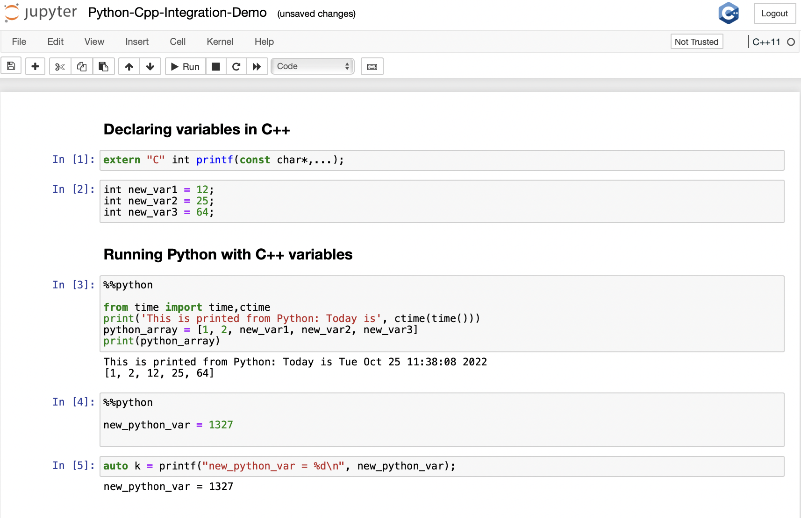

## Try it online

To try out xeus-clang-repl interactively in your web browser, just click on the binder
link:

[](https://mybinder.org/v2/gh/compiler-research/xeus-clang-repl/v0.2.0?labpath=notebooks/index.ipynb)

### Xeus-Clang-REPL

## Description

`xeus-clang-repl` integrates clang-repl with the xeus protocol and is a platform for C++ usage in Jupyter Notebooks. The demo developed in this repository shows a Python - CPP integraton in Jupyter Notebooks, where variables can be transfered between Python and CPP.

`Disclaimer: this work is highly experimental and might not work beyond the examples provided`

## Installation

xeus-clang-repl has not been packaged for the mamba (or conda) package manager.

To ensure that the installation works, it is preferable to install `xeus-clang-repl` in a
fresh environment. It is also needed to use a
[miniforge](https://github.com/conda-forge/miniforge#mambaforge) or
[miniconda](https://conda.io/miniconda.html) installation because with the full
[anaconda](https://www.anaconda.com/) you may have a conflict with the `zeromq` library
which is already installed in the anaconda distribution.

First clone the repository, and move into that directory
```bash
git clone --depth=1 https://github.com/compiler-research/xeus-clang-repl.git
cd ./xeus-clang-repl
```
The safest usage of xeus-clang-repl is to build and install it within a clean environment named `xeus-cpp`. You can create and activate this environment 
with mamba by executing the following
```bash
mamba create -n "xeus-clang-repl" python=3.10.6
mamba activate "xeus-clang-repl"
```
We will now install the dependencies needed to compile xeus-clang-repl from source within this environment by executing the following
```bash
mamba install --quiet --yes -c conda-forge \
                               cmake \
                              'xeus>=2.0' \
                              xeus-zmq \
                              'nlohmann_json>=3.9.1,<3.10' \
                              'cppzmq>=4.6.0,<5' \
                              'xtl>=0.7,<0.8' \
                              'openssl<4' \
                              ipykernel \
                              pugixml \
                              zlib \
                              libxml2 \
                              'cxxopts>=2.2.1,<2.3' \
                              libuuid \
                              pytest \
                              jupyter_kernel_test 
mamba install -y jupyter
```
We are now in a position to be able to install xeus-clang-repl by executing the following
```bash
git clone --depth=1 https://github.com/compiler-research/xeus-clang-repl.git
git clone --depth=1 -b release/17.x https://github.com/llvm/llvm-project.git
cd llvm-project
git apply -v ../xeus-clang-repl/patches/llvm/clang17-*.patch
mkdir build
cd build
cmake -DLLVM_ENABLE_PROJECTS=clang                  \
      -DLLVM_TARGETS_TO_BUILD="host;NVPTX"          \
      -DCMAKE_BUILD_TYPE=Release                    \
      -DLLVM_ENABLE_ASSERTIONS=ON                   \
      -DLLVM_ENABLE_LLD=ON                          \
      -DCLANG_ENABLE_STATIC_ANALYZER=OFF            \
      -DCLANG_ENABLE_ARCMT=OFF                      \
      -DCLANG_ENABLE_FORMAT=OFF                     \
      -DCLANG_ENABLE_BOOTSTRAP=OFF                  \
      ../llvm
cmake --build . --target clang clang-repl --parallel $(nproc --all)
LLVM_BUILD_DIR=$PWD
cd ../..
git clone --depth=1 https://github.com/compiler-research/CppInterOp.git
mkdir CppInterOp/build
cd  CppInterOp/build
cmake -DBUILD_SHARED_LIBS=ON -DUSE_CLING=Off -DUSE_REPL=ON -DLLVM_DIR=$LLVM_DIR/build/lib/cmake/llvm -DClang_DIR=$LLVM_DIR/build/lib/cmake/clang ..
cmake --build . --parallel $(nproc --all)
CPPINTEROP_BUILD_DIR=$PWD
cd ../../xeus-clang-repl
mkdir build
cd build
cmake -DCMAKE_BUILD_TYPE=Release \
      -DLLVM_CMAKE_DIR=$LLVM_BUILD_DIR \
      -DCMAKE_PREFIX_PATH=$(conda info --base) \
      -DCMAKE_INSTALL_PREFIX=$(conda info --base) \
      -DCMAKE_INSTALL_LIBDIR=lib \
      -DLLVM_CONFIG_EXTRA_PATH_HINTS=$LLVM_BUILD_DIR/lib \
      -DCPPINTEROP_DIR=$CPPINTEROP_BUILD_DIR \
      -DLLVM_USE_LINKER=lld  \
      .. 
cmake --build . --target install --parallel $(nproc --all)
```

## Docker
It is possible to build xeus-clang-repl within a Docker container. On an arm based Apple machine with docker, docker-compose and colima installed, you can try out xeus-clang-repl using the following commands (cpu represents number of cores, and memory is in GiB, so adjust according to your machine)
```bash
git clone https://github.com/compiler-research/xeus-clang-repl.git
cd xeus-clang-repl
colima start --cpu 8 --memory 8 --arch aarch64 --vm-type=vz --vz-rosetta
chmod a+x ./build-and-run-docker.sh
./build-and-run-docker.sh
```
Once the bash script finishes running, you can experiment with xeus-clang-repl by opening up your browser and visiting http://127.0.0.1:8888/lab


## Try it online (for developers)

To try out xeus-clang-repl interactively in your web browser, just click on the binder
link (Warning! This is Nightly build):

[](https://mybinder.org/v2/gh/compiler-research/xeus-clang-repl/HEAD?labpath=notebooks/index.ipynb)




## Documentation

To get started with using `xeus-clang-repl`, The Documentation work is under Development.

## Dependencies

`xeus-clang-repl` depends on

- [xtl](https://github.com/xtensor-stack/xtl)
- [nlohmann_json](https://github.com/nlohmann/json)
- [cppzmq](https://github.com/zeromq/cppzmq)
- [clang](https://github.com/llvm/llvm-project/)
- [cxxopts](https://github.com/jarro2783/cxxopts)

|   `xeus-clang-repl`   |       `xtl`     |  `clang`  | `pugixml` | `cppzmq` | `cxxopts` | `nlohmann_json` | `dirent` (windows only) |
|-----------------------|-----------------|-----------|-----------|----------|-----------|-----------------|-------------------------|
|   	~0.1.0 		      |  >=0.7.0,<0.8.0 | >=16,<17  | ~1.8.1    | ~4.3.0   |  >=3.0.0  |  >=3.6.1,<4.0   |    >=2.3.2,<3           |

## License

This software is licensed under the `Apache License`. See the [LICENSE](LICENSE)
file for details.
