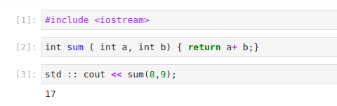
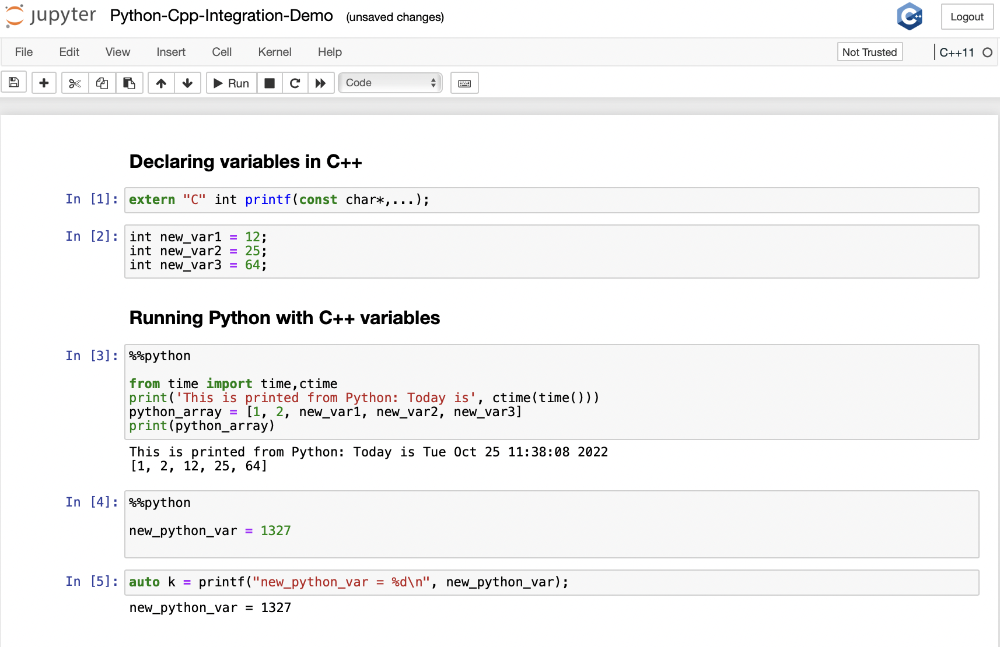

Tutorials
---------

This tutorial emphasises the abilities and usage of Xeus-Clang-REPL. Let's get
started! The tutorial demonstrates examples of C++ and C++-python integration
on Jupyter kernels.

1. Install the xeus-clang-repl using conda forge (from source) or run it using the
Dockerfile.

2. Launch the Jupyter Notebook with C++-14, C++-17 kernels available.

3. In a code cell, write the C++ code.

4. Run the code cell. The xeus-clang-repl kernel will compile and execute the code.
   The output would be displayed below the respective cell.

C++
===

In this example, you can modify the code and execute the cell again to see the
updated results. For example, you might change the values of `a` and `b`
(function arguments) of the function `sum` to see expected output. You can try
out different examples to explore the features of C++.

The output of the cell will be displayed below once the code is executed and
xeus-clang-repl provides an interactive environment, where you can promptly make
the changes and prototype in C++.

C++-Python Integration:
=======================

In this example, we are emphasising the concept of C++-Python integration, where
we use Python and C++ in the same session, sharing variables, scopes, and features.
Here, we have used variables (`new_var1`, `new_var2`, `new_var3`)
in python which have been initialised in C++. In the following context, we have
tried the vice versa as well of using the variables in Python (`new_python_var`)
which have been defined in C++.

The project is under development and is subject to changes as C++-Python integration
within the same Jupyter cell is quite challenging. Please ensure that you have
xeus-clang-repl and your Jupyter environment set up before attempting to run C++
code. The installation instructions can be found in this documentation for xeus-clang-repl.